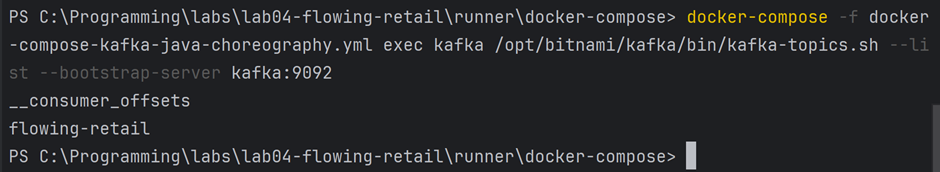
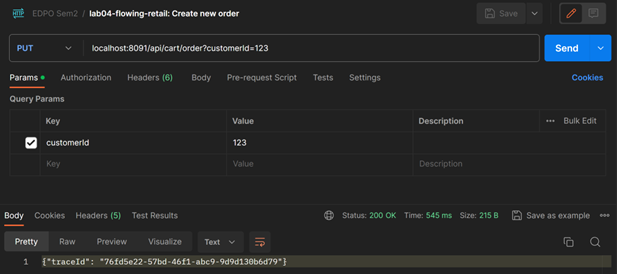
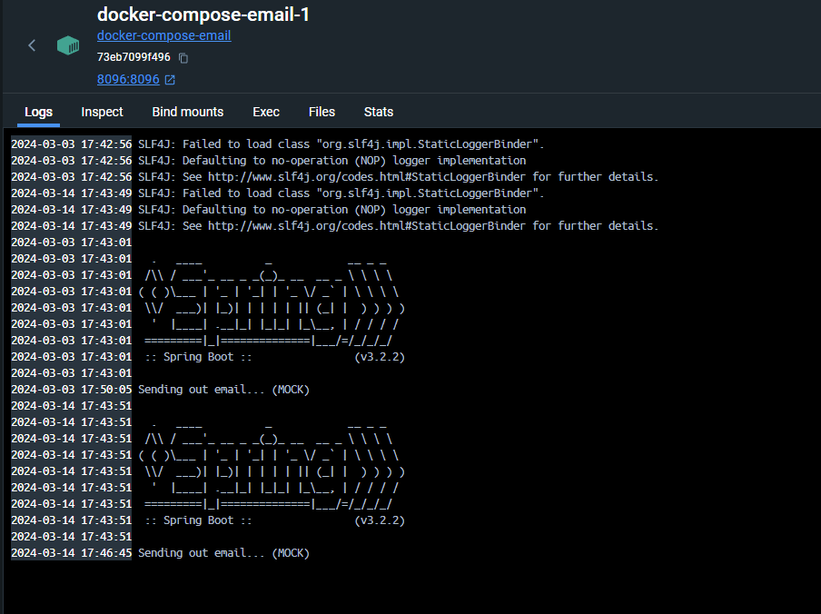

# E-Mail Service
The email service listens to different events and sends out emails.

## Scenario
The message listener listens to Kafka events published on the topic flowing-retail. If the message type equals to OrderPlacedEvent (new event type, and currently published by the checkout service when an order was placed), the event is picked up and an email is sent out.

## Steps to reproduce the experiment
**Experiment: An email is sent after an order is checked out by listening to Kafka events**

1. Please check the fork at https://github.com/972C8/lab04-flowing-retail-group2 for the code. Essentially, the
lab04-flowing-retail project was extended with an email service that sends mock notifications when an order is
triggered.
2. Following the top-level README:
   1. mvn clean install
   2. cd runner/docker-compose
   3. Run all services in docker with "docker-compose -f **docker-compose-kafka-java-choreography.yml** up"
3. Staying in runner/docker-compose, verify that “flowing-retail” is an active topic:
   1. docker-compose -f docker-compose-kafka-java-choreography.yml exec kafka /opt/bitnami/kafka/bin/kafka-topics.sh --list --bootstrap-server kafka:9092 
   2. 
4. Fill up the inventory
   1. curl X POST http://localhost:8094/api/inventory/
   2. or via POSTMAN
5. Simulate a new order
   1. curl -X PUT http://localhost:8091/api/cart/order?customerId="0815”
   2. or via POSTMAN
      1. 
6. Result
   1. 